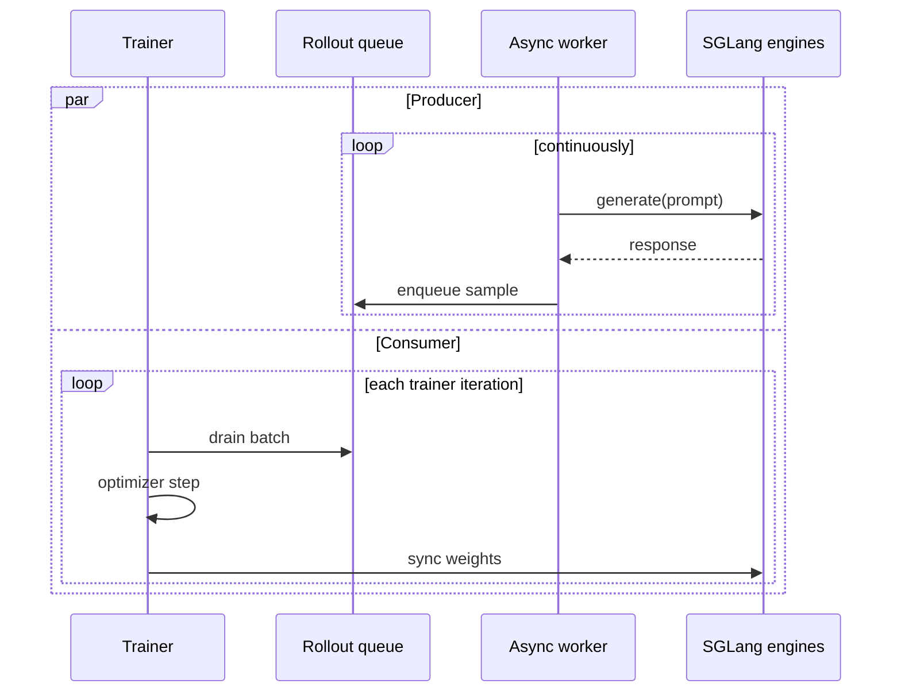

Fully async rollout splits Miles into two concurrent loops:

1. A background rollout worker keeps SGLang generation in flight and pushes completed
   samples into a queue.
2. The trainer drains the queue, runs optimizer steps, and syncs updated weights back
   to rollout engines.

When rollout and training take similar time, per-iteration wall time moves from
`rollout_time + train_time` toward `max(rollout_time, train_time)`.

## When to use it

| Use fully async when | Stay synchronous when |
|---|---|
| Rollout is a large part of wall time | Debugging a new recipe |
| The run is long enough to amortize queue warm-up | You need the strictest possible on-policy cadence |
| SGLang engines can keep many requests in flight | Queue depth stays at zero even after tuning concurrency |
| You can tolerate slightly older samples in exchange for throughput | You are validating loss math or reward plumbing |

The mode is especially useful for long-context math, tool-use, and agentic workloads
where generation dominates the iteration.

## Enable it

Switch the entrypoint from `train.py` to `train_async.py`, enable the class-based
rollout API, and pass `--fully-async`:

```diff
- python3 train.py ...
+ MILES_EXPERIMENTAL_ROLLOUT_REFACTOR=1 python3 train_async.py ...
+   --fully-async
```

`--fully-async` selects the built-in rollout worker, which also serves evaluation
(shared-engine by default, dedicated-fleet or external-service via the options in
[Evaluation](#evaluation) below). When submitting through Ray, propagate
`MILES_EXPERIMENTAL_ROLLOUT_REFACTOR=1` in the job's `runtime_env`.

Everything else belongs in the same [argument groups](/user-guide/argument-groups) as a
synchronous run.

## Queue model



The queue is the contract. If it stays populated, the trainer does not wait for
generation. If it is empty, rollout is still the bottleneck and async cannot hide it.

## Tuning knobs

| Knob | What it changes |
|---|---|
| `--rollout-batch-size` | Target amount of work the async producer keeps in flight |
| `--sglang-server-concurrency` | Per-engine request concurrency |
| `--global-batch-size` | Number of samples the trainer drains per step |
| `--num-steps-per-rollout` | Number of optimizer steps per queue drain cycle |
| `--max-weight-staleness` | When the rollout engine's weight version lags the trainer's by more than this, the worker recycles the stale group instead of feeding it to the loss |

The worker caps its output queue at 1000 groups, so if training is slower than
rollout the producer eventually blocks rather than growing the queue without
bound. If the queue stays at zero, rollout is the bottleneck — scale rollout capacity
or lower per-sample generation cost.

## What to monitor

The worker reports per-step metrics to wandb/dashboard alongside the standard rollout
metrics:

```text
rollout/fully_async/queue_size
rollout/fully_async/aborted_groups_recycled
rollout/fully_async/stale_groups_recycled
rollout/fully_async/avg_staleness, rollout/fully_async/max_staleness
```

A `No completed rollout groups for <N>s` warning in the logs means the drain is
starved — rollout is the bottleneck.

Treat large staleness windows as a training-quality signal, not just a performance
signal. Fast [P2P weight transfer](/advanced/p2p-weight-transfer) keeps the
rollout engines closer to the latest actor weights so fewer groups get recycled by
`--max-weight-staleness`.

## Evaluation

Pick a posture by two questions: is this a test run or a real run (are checkpoints
persisted anyway), and does eval get standalone GPU resources?

| | Test run | Real run |
|---|---|---|
| **No standalone eval** | Pause-the-world (shared engines) | External service over `--save-hf` output; pause-the-world if eval must be strictly on-time (costs ~eval duration of rollout production per point). The two compose: pause-the-world on a small sanity set for on-time points, the service on the full set for delayed high-fidelity points |
| **Standalone eval fleet** | Fleet + tmpfs snapshot (`--eval-hf-dir /dev/shm/...`) | Fleet + checkpoint reuse (no `--eval-hf-dir`) |

Without extra GPUs (`--eval-num-gpus` unset), eval **shares the rollout engines**:
the producer pauses new submissions for the duration of the blocking eval and resumes
after. This is a gate, not a retract — in-flight rollout requests finish and buffer,
nothing is aborted, and the `pause_generation` API is never involved; eval requests
simply share engine capacity with the draining tail.

No extra weight movement happens either: the engines already carry the weights the
step's `update_weights` broadcast just pushed (in fully-async, only *generation* is
continuous — weight updates are still driver-scheduled per step, each with its own
generation pause per `--pause-generation-mode`; eval adds no pause of its own on top).
Pinning comes from ordering: the driver awaits the eval, so the next
`update_weights` cannot interleave —
expect `mixed_version_ratio == 0` with the training fleet's update counter as the
version label (a constant offset from `eval/step`, unlike the dedicated fleet which
stamps the rollout_id). This ordering is also why shared-engine eval must stay
blocking: fired-and-forgotten, the next weight update would rewrite the engines
mid-eval. The cost is that rollout production stalls for roughly the eval duration,
which is fine for small debug eval sets.

For eval that never touches training capacity, use a **dedicated eval fleet** synced
through HF checkpoint snapshots — never by joining training weight updates:

```bash
--eval-num-gpus 1                        # dedicated eval engines (own router)
--eval-interval K
--eval-hf-dir /dev/shm/miles_eval_hf     # snapshot staging; tmpfs = no disk dependency
--eval-prompt-data aime /path/to/aime.jsonl
```

Per eval-due step the trainer exports an HF snapshot, fires the eval
**fire-and-forget**, and keeps training; the fleet pins its engines to the snapshot
(`weight_version = str(rollout_id)`) and your `--eval-function-path` fn generates
against them exactly as it would against the training engines, so custom eval fns
work on the fleet unchanged. The point lands at the right x-axis step even when it
completes a few steps later (`eval/lag_steps` reports how late).

The export itself is not fire-and-forget: it is a collective across every train
actor and the training loop waits for it, `eval/export_time_seconds` per point
(~7 s for a 4B model on tmpfs, more with model size or a disk-backed
`--eval-hf-dir`). Under `--eval-overflow-policy backpressure` a due point can also
wait out the oldest pending eval. Reuse mode has neither cost.

The fleet's engines **inherit every `--sglang-*` setting** from the rollout engines, so by
default they are configured exactly like the engines you already tuned. Override any single
field with the matching `--eval-sglang-*` flag:

```bash
--eval-sglang-mem-fraction-static 0.9      # eval fleet is not sharing with training
--no-eval-sglang-enable-dp-attention       # booleans take a --no- form to turn an inherited True off
```

Not everything is inheritable. TP comes from `--eval-num-gpus-per-engine`, which also places
the engines, so a separate `--eval-sglang-tp-size` could move one without the other. SGLang
ties `dp_size`, `pp_size`, `ep_size` and `attn_cp_size` to TP, so when the eval TP differs
from the rollout TP those four default to 1 rather than being inherited — inheriting them
across a different TP produces an engine that fails SGLang's own validation at boot. Set them
explicitly with `--eval-sglang-*` if the eval fleet is large enough to want them. The
routing/indexer replay side-channels are always off: eval samples never feed training, so
returning routed experts is pure overhead.

Size the staging dir before pointing it at tmpfs. Snapshots are retired on every
outcome, but the dir holds up to

```
--eval-keep-snapshots  (retired, kept for inspection)  +  --eval-max-in-flight  (exported, still evaluating)
```

model-sized directories at once — 4 by default, so ~32 GB of `/dev/shm` for a 4B model in
bf16. Evals are serialized inside the trainer, so raising `--eval-max-in-flight` does not
run more of them at once; it lets the trainer export further ahead, and costs one more
snapshot on disk.

Two production-oriented variants:

- **Reuse mode**: with `--save-hf` set and `--eval-hf-dir` unset, eval reuses the
  periodic HF checkpoints (requires `eval_interval % save_interval == 0`) — zero extra
  export cost. Pair with `--eval-overflow-policy skip` so a slow eval set can never
  stall training.
- **External backend**: subclass `CheckpointEvalFn` (`miles/rollout/checkpoint_eval.py`)
  and implement `evaluate_checkpoint(checkpoint_dir, input)` — the trainer exports a
  snapshot per eval point, hands over its path, and owns dispatch/logging/GC; raise
  `EvalSkip(reason)` for an attributable skipped point. No GPU carve-out from the
  training job, and because the fn runs in-job it reads the real training args
  (nothing hand-copied) and logs through the trainer.
  `examples/fully_async/external_eval_fn.py` is the reference implementation: it
  launches its own sglang server on spare GPUs (`MILES_EXTERNAL_EVAL_GPUS=6,7`, extra
  sglang flags via `MILES_EXTERNAL_EVAL_SERVER_ARGS`) or attaches to one anywhere
  (`MILES_EXTERNAL_EVAL_URL`); set
  `--eval-function-path examples.fully_async.external_eval_fn.ExternalSglangEvalFn`.
  A non-sglang black box implements the same contract by calling out to its API and
  mapping the response into `RolloutFnEvalOutput`.
  `examples/fully_async/run_qwen3_5_4b_fully_async_eval.py` launches either backend
  behind one flag (`--eval-backend fleet|external`).

`--eval-num-gpus` and a `CheckpointEvalFn` `--eval-function-path` each pick a backend,
so passing both is an error rather than the fleet winning and handing the work over.

Every skipped point is attributable from the dashboard, logged at the affected step:
`eval/skipped_busy` (at `--eval-max-in-flight` under `--eval-overflow-policy skip`),
`eval/skipped_export_failed`, `eval/skipped_ckpt_missing` (no `.complete` marker),
`eval/skipped_unhealthy` (fleet or its router unreachable), `eval/skipped_pin_violation`
(engines did not all report the expected `weight_version`), and `eval/skipped_crashed`
(anything else the eval raised). `eval/{ds}/weight_version/mean == eval/step` and
`mixed_version_ratio == 0` confirm every point measured exactly the intended weights.

The eval-engine `weight_version` namespace is the snapshot's `rollout_id` — deliberately
different from the training fleet's job-local update counter; the two fleets never mix.

Where each posture's weights come from — and what "the weights at step R" means:

| Posture | Weight delivery | Measures |
|---|---|---|
| Pause-the-world | none needed — training's own `update_weights` broadcast already put them on the shared engines | the engines' last-broadcast version (equals the actor's current weights when `update_weights_interval` is 1) |
| Dedicated fleet | `update_weights_from_disk` on a snapshot exported **directly from the actor** | the actor's exact step-R weights, regardless of broadcast schedule |
| External backend | the eval fn loads the snapshot into its own server | the actor's exact step-R weights |

Eval engines are never added to the training broadcast group: collectives cannot skip
members, so a fleet inside the group would have its weights rewritten by every update
and asynchronous points could not be pinned.

## Example implementation

For a complete Qwen3 launch script and worker implementation, see the
[Fully Async Rollout example](/examples/fully-async).
